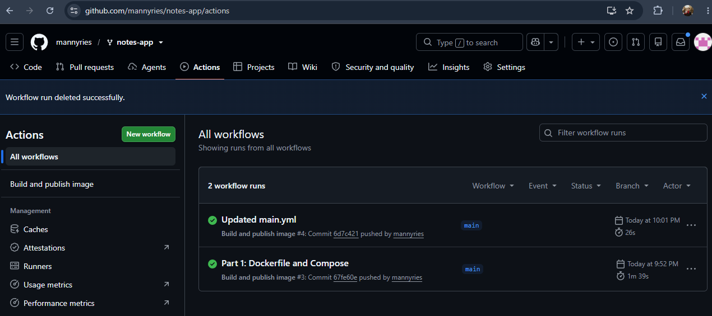
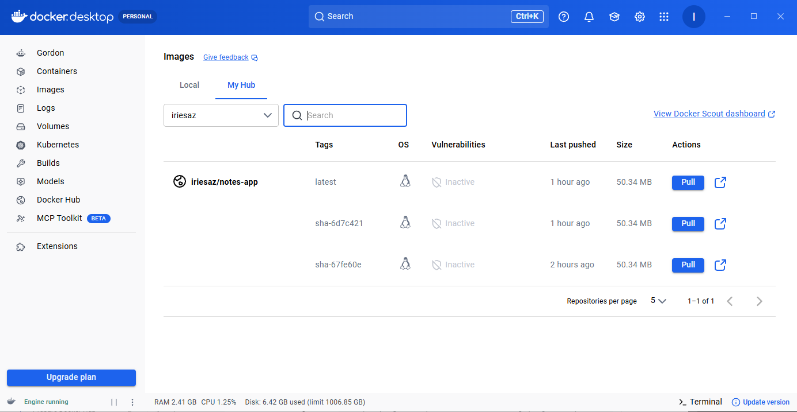

# Lab 5 Evidence

## 1. Successful GitHub Actions Run

---

## 2. Docker Hub Tags and Architectures

Screenshot showing `latest` and `sha-...` tags and both `linux/amd64` and `linux/arm64`:

---

## 3. output of kubectl get all,pvcs
OUTPUT: 
PS C:\Users\walte\Documents\MIS547\notes-app> kubectl get all,pvc
NAME                       READY   STATUS    RESTARTS   AGE
pod/db-6c5c8947cd-gskr9    1/1     Running   0          18m
pod/web-699846db59-954kw   1/1     Running   0          20m
pod/web-699846db59-vwdnv   1/1     Running   0          20m

NAME          TYPE        CLUSTER-IP      EXTERNAL-IP   PORT(S)    AGE
service/db    ClusterIP   10.96.24.199    <none>        5432/TCP   31m
service/web   ClusterIP   10.96.140.106   <none>        80/TCP     23m

NAME                  READY   UP-TO-DATE   AVAILABLE   AGE
deployment.apps/db    1/1     1            1           31m
deployment.apps/web   2/2     2            2           23m

NAME                             DESIRED   CURRENT   READY   AGE
replicaset.apps/db-6c5c8947cd    1         1         1       31m
replicaset.apps/web-699846db59   2         2         2       23m

NAME                            STATUS   VOLUME                                     CAPACITY   ACCESS MODES   STORAGECLASS   VOLUMEATTRIBUTESCLASS   AGE
persistentvolumeclaim/db-data   Bound    pvc-0c868ce2-2c36-4d5b-9bb4-942bb09e7a36   1Gi        RWO            standard       <unset>                 31m
---

## 4. The output of the curl commands from Experiments 2 and 3 in Part 3
OUTPUT Experiment #2: 
[{"body":"I should survive a pod deletion","created_at":"2026-09-30T06:10:53.018423+00:00","id":1}

OUTPUT Experiment #3:
{"message":"Hello From Manny!","served_by":"web-699846db59-954kw","service":"notes-app"}

{"message":"Hello From Manny!","served_by":"web-699846db59-75tmf","service":"notes-app"}

{"message":"Hello From Manny!","served_by":"web-699846db59-954kw","service":"notes-app"}

{"message":"Hello From Manny!","served_by":"web-699846db59-vwdnv","service":"notes-app"}
---

## 5. The output of kubectl rollout history deployment/web
OUTPUT: 
deployment.apps/web
REVISION  CHANGE-CAUSE
1         <none>
2         <none>